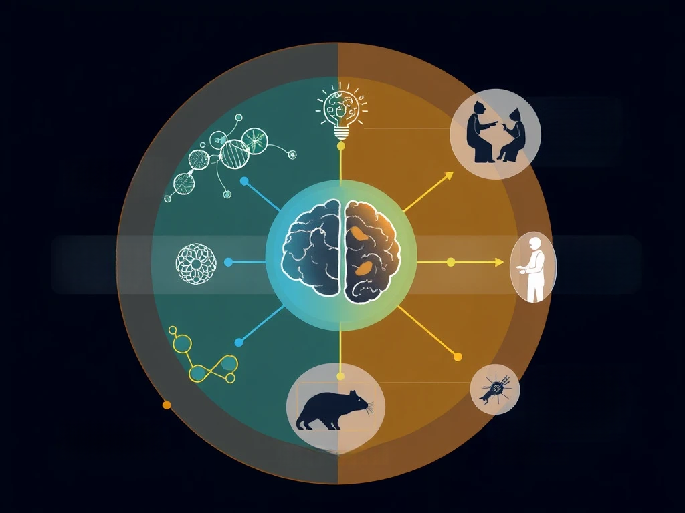

# Welcome to the Genmoics and Artificial Intelligence in Healthcare Lab!
{: .display-4}
 
We are part of the [Department of Health Technology and Informatics](https://www.polyu.edu.hk/hti/).
{: .welcomefont}

{:style="max-width: 100%; height: auto;"}

Research in the lab is focused on advancing genomic medicine and developing AI technology for healthcare.  We are interested in interdisciplinary systems biology and genomics.
{: .welcomefont}

We are located in Lee Shau Kee Building of The Hong Kong Polytechnic University.
{: .welcomefont}
